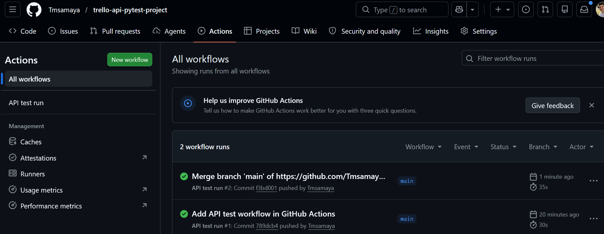
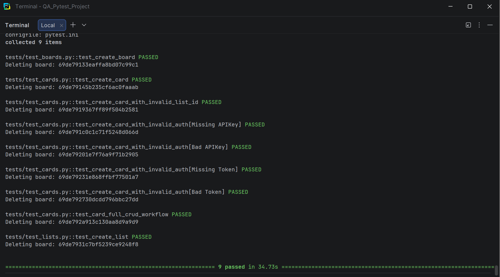
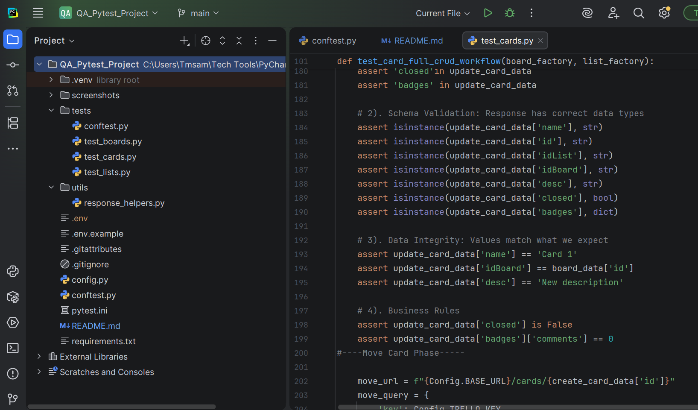

# 🧪 Trello API Test Automation Framework (Pytest)

A Python-based API testing framework built with **pytest** to validate Trello's REST API.

This project demonstrates real-world QA automation practices, including structured test design, reusable test architecture, and CI-based execution.

---

## 🚀 Features

- ✅ Full CRUD testing for Trello resources (Boards, Lists, Cards)
- ✅ Factory-based test data creation (`board_factory`, `list_factory`, `card_factory`)
- ✅ Parametrized negative tests (invalid/missing authentication)
- ✅ Structured validation approach:
  - Structure
  - Schema
  - Data Integrity
  - Business Rules
- ✅ End-to-end workflow test:
  - Create → Update → Move → Delete card
- ✅ Debug helpers with safe credential handling
- ✅ CI integration using GitHub Actions

---

## 🛠 Tech Stack

- Python
- Pytest
- Requests
- GitHub Actions (CI)
- Trello REST API

---

## ⚙️ Setup

### 1. Clone the repo
```bash
git clone https://github.com/YOUR_USERNAME/YOUR_REPO.git
cd YOUR_REPO
```

### 2. Install dependencies
```bash
pip install -r requirements.txt
```

### 3. Add your Trello credentials

Create a `.env` file:

```env
TRELLO_KEY=your_key
TRELLO_TOKEN=your_token
```

---

## ▶️ Running Tests

Run all tests:
```bash
pytest -v
```

Run with debug output:
```bash
pytest -v -s
```

---

## 🧪 Test Coverage

### Positive Tests
- Create Board / List / Card
- Validate response structure and schema
- Verify data integrity
- Validate business rules

### Negative Tests
- Missing token/key
- Invalid token/key
- Invalid list IDs

### Workflow Test

End-to-end scenario:

1. Create board  
2. Create lists (To Do / Done)  
3. Create card with description  
4. Update description  
5. Move card between lists  
6. Delete card  
7. Validate deletion  

---

## 📸 Test Execution

### CI Pipeline (GitHub Actions)


### Local Test Run (Pytest)


### CRUD Workflow Example


---

## 💡 Key Design Decisions

### Factory Pattern
Reusable fixtures dynamically generate test data:
- `board_factory()`
- `list_factory()`
- `card_factory()`

---

### Parametrized Testing
Efficient validation of multiple failure scenarios using pytest parametrization.

---

### Debug Strategy
Custom debug helpers provide structured output while safely masking sensitive credentials.

---

## 📌 Future Improvements

- Add schema validation with JSON Schema  
- Add HTML reporting (pytest-html or Allure)  
- Expand negative test coverage  

---

## 🎯 Purpose

This project demonstrates:

- Real-world API testing strategies  
- Strong understanding of test design principles  
- Translation of Postman testing into automated frameworks  
- Clean, maintainable test architecture  
- CI-integrated automated validation  

---

## 🔗 Author

Tomas Amaya